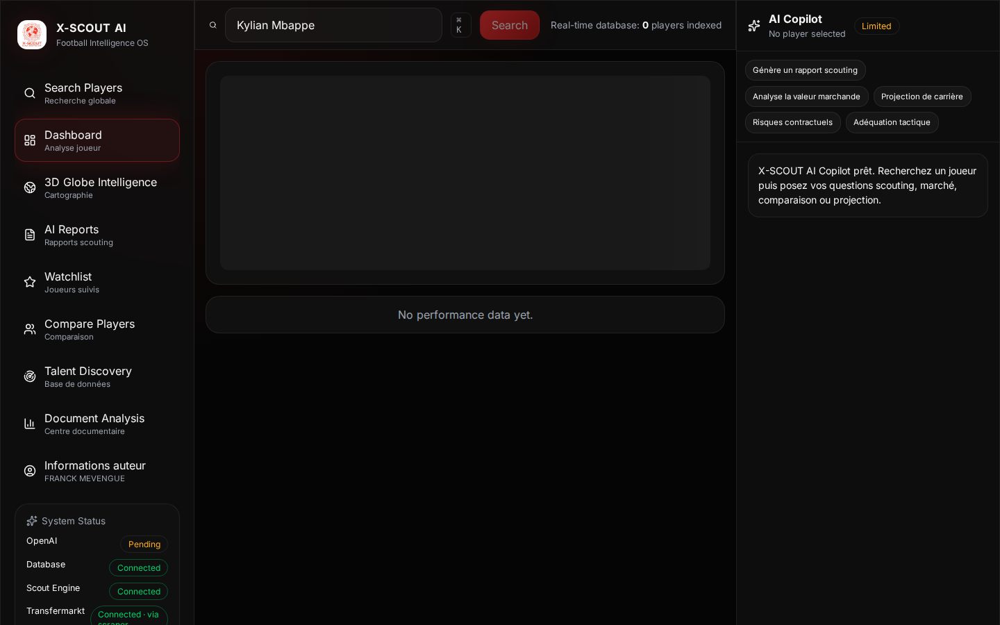
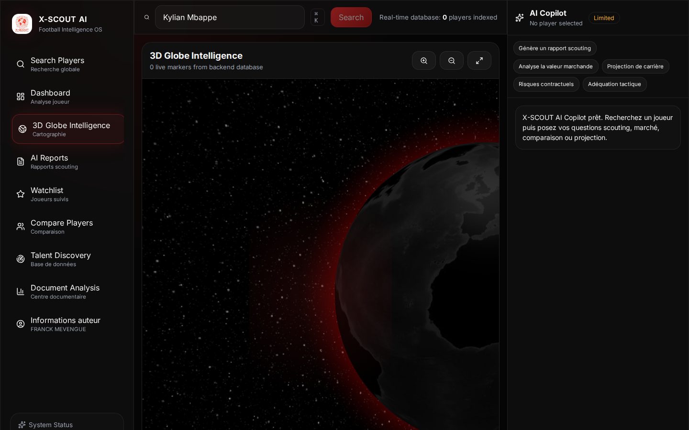
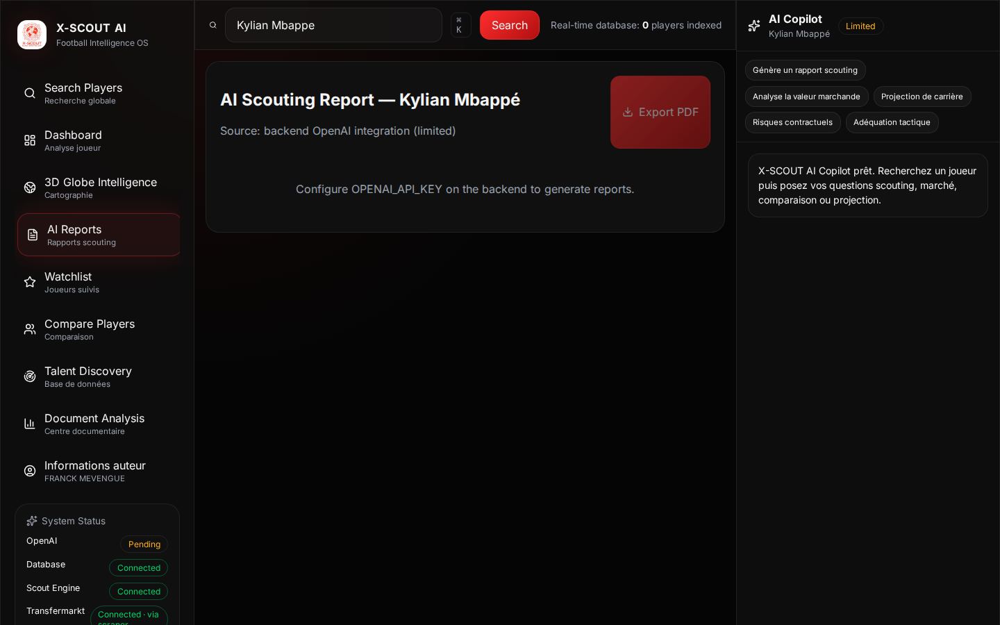
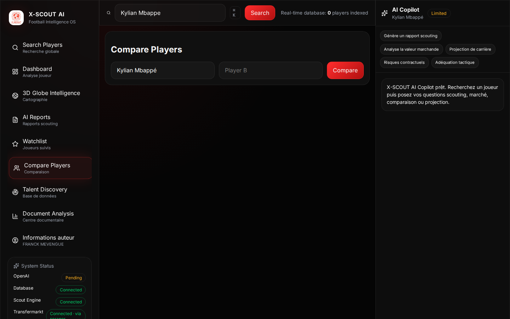
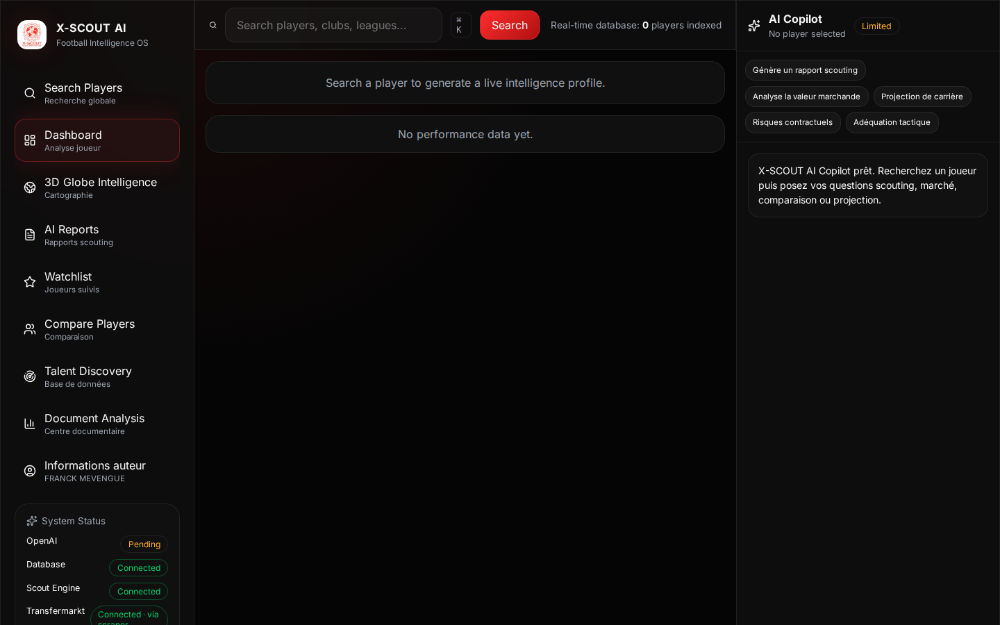
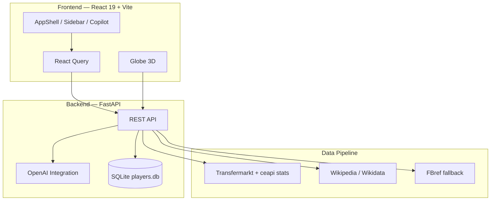
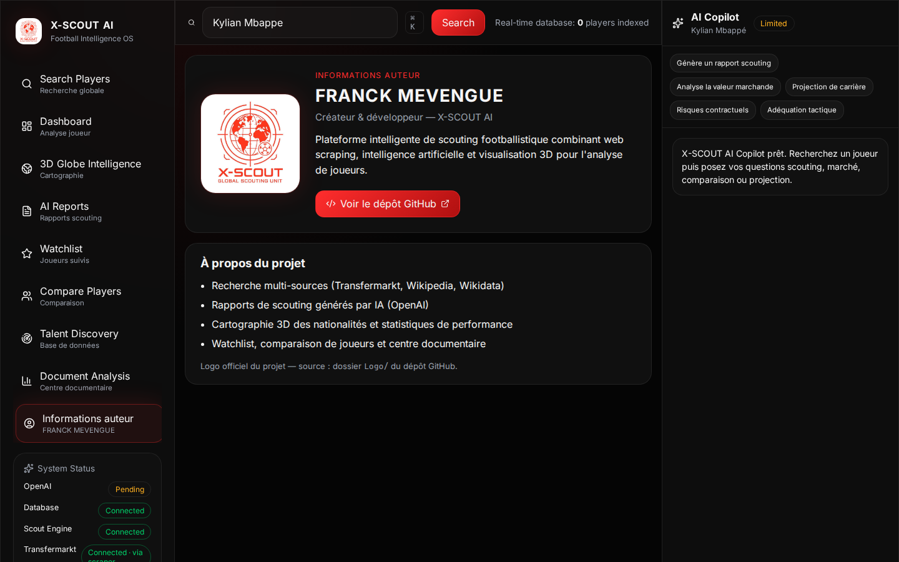

<div align="center">

# X-SCOUT AI


**Football Intelligence OS — scouting augmenté par IA, données live et visualisation 3D**

[](https://react.dev/)
[](https://fastapi.tiangolo.com/)
[](https://www.python.org/)
[](https://openai.com/)
[](https://www.typescriptlang.org/)
[](https://vitejs.dev/)

Interface premium inspirée des outils d’analyse professionnels (Palantir, Hudl, Wyscout) — pensée pour les recruteurs, analystes et passionnés de data football.

[🚀 Démarrage rapide](#-démarrage-rapide) · [🎬 Démo](#-démo-vidéo) · [📸 Captures](#-aperçu-de-linterface) · [⚙️ Configuration](#-configuration) · [🔌 API](#-api-endpoints)

</div>

---

## 🎬 Démo vidéo

<p align="center">
  <video src="docs/assets/x-scout-demo.mp4" width="920" autoplay loop muted playsinline controls>
    Votre navigateur ne supporte pas la lecture vidéo — <a href="docs/assets/x-scout-demo.mp4">télécharger la démo</a>.
  </video>
</p>

<p align="center"><em>Recherche joueur → Dashboard → Globe 3D → Rapports IA → Comparaison → Informations auteur</em></p>

---

## 📸 Aperçu de l’interface

<table>
  <tr>
    <td width="50%">
      
      <p align="center"><strong>Dashboard joueur</strong><br/>Profil complet, KPIs et courbes de performance</p>
    </td>
    <td width="50%">
      
      <p align="center"><strong>Globe 3D Intelligence</strong><br/>Cartographie interactive des joueurs indexés</p>
    </td>
  </tr>
  <tr>
    <td width="50%">
      
      <p align="center"><strong>AI Reports</strong><br/>Rapports scouting exportables en PDF</p>
    </td>
    <td width="50%">
      
      <p align="center"><strong>Compare Players</strong><br/>Analyse comparative multi-critères</p>
    </td>
  </tr>
</table>

<p align="center">
  
  <br/>
  <strong>Shell applicatif</strong> — sidebar, recherche globale, copilot IA et bandeau d’insights temps réel
</p>

---

## ✨ Pourquoi X-SCOUT ?

| Capacité | Ce que vous obtenez |
|----------|---------------------|
| **Recherche intelligente** | Normalisation des noms (accents, fautes), matching Transfermarkt, exclusion des équipes réserves |
| **Stats live** | Buts, passes, matchs via API Transfermarkt `ceapi` (+ fallback FBref) |
| **IA Copilot** | Chat contextuel sur le joueur actif, rapports scouting structurés |
| **Globe 3D** | Visualisation géographique fluide (react-globe.gl / Three.js) |
| **Watchlist & Compare** | Suivi de cibles et comparaison radar / barres |
| **Document Center** | Analyse de PDF/texte côté client + enrichissement via `/ai` |
| **Talent Discovery** | Exploration de la base SQLite indexée |
| **UX premium** | Dark glass UI, Framer Motion, Recharts, React Query |

---

## 🏗️ Architecture



**Déploiement recommandé**

| Composant | Plateforme | Variable clé |
|-----------|------------|--------------|
| Frontend | [Vercel](https://vercel.com) | `VITE_API_URL` |
| Backend | [Railway](https://railway.com) | `OPENAI_API_KEY` |

---

## 🛠️ Stack technique

**Backend** — FastAPI · SQLite · BeautifulSoup · curl_cffi / cloudscraper · OpenAI SDK

**Frontend** — React 19 · TypeScript · Vite 6 · TanStack Query · Framer Motion · Recharts · Lucide · jsPDF · pdf.js · react-globe.gl

---

## 🚀 Démarrage rapide

### Prérequis

- Python **3.8+**
- Node.js **18+**
- Clé API OpenAI ([platform.openai.com](https://platform.openai.com/api-keys))

### 1. Cloner le dépôt

```bash
git clone https://github.com/MEVENGUE/Outils-IA-pour-scouting-football-.git
cd Outils-IA-pour-scouting-football-
```

### 2. Backend

```bash
cd backend
pip install -r requirements.txt
cp ../.env.example ../.env   # puis éditez OPENAI_API_KEY
python3 -m uvicorn main:app --reload --host 127.0.0.1 --port 8000
```

Health check : [http://127.0.0.1:8000/health](http://127.0.0.1:8000/health)  
Swagger : [http://127.0.0.1:8000/docs](http://127.0.0.1:8000/docs)

### 3. Frontend

```bash
cd frontend
npm install
npm run dev
```

Application : [http://localhost:5173](http://localhost:5173)

### 4. Premier test

1. Ouvrir l’app dans le navigateur  
2. Rechercher `Kylian Mbappe` (sans accent — la normalisation corrige)  
3. Explorer le **Dashboard**, le **Globe 3D**, les **AI Reports** et le **Copilot**

---

## ⚙️ Configuration

### Variables d’environnement

| Variable | Où | Description |
|----------|-----|-------------|
| `OPENAI_API_KEY` | Backend (`.env` ou Railway) | Rapports IA, copilot, enrichissement |
| `VITE_API_URL` | Frontend (`.env` ou Vercel) | URL du backend (ex. `https://votre-api.railway.app`) |

**Backend** — créer `.env` à la racine :

```env
OPENAI_API_KEY=sk-...
```

**Frontend** — créer `frontend/.env.local` :

```env
VITE_API_URL=http://127.0.0.1:8000
```

> La clé OpenAI ne doit **jamais** être exposée côté frontend. Seul le backend appelle OpenAI.

### Vérification

```bash
curl http://127.0.0.1:8000/health
# {"status":"healthy","database":"connected","openai":"configured"}
```

---

## 🧭 Modules de l’application

| Vue | Description |
|-----|-------------|
| **Search Players** | Recherche globale et chargement de profil |
| **Dashboard** | Fiche joueur, KPIs, graphiques Recharts, watchlist |
| **3D Globe Intelligence** | Carte mondiale des joueurs en base |
| **AI Reports** | Rapport scouting + export PDF |
| **Watchlist** | Joueurs suivis (localStorage) |
| **Compare Players** | Comparaison visuelle de deux profils |
| **Talent Discovery** | Parcours de la base indexée |
| **Document Analysis** | Upload PDF/texte et analyse IA |
| **Informations auteur** | FRANCK MEVENGUE — créateur du projet |

---

## 📁 Structure du projet

```
Outils-IA-pour-scouting-football-/
├── backend/
│   ├── main.py              # API FastAPI
│   ├── database.py          # SQLite + upsert joueurs
│   └── scraping/scraper.py  # Pipeline TM / FBref / Wikidata
├── frontend/
│   ├── src/
│   │   ├── layout/          # AppShell, Sidebar, Copilot, TopBar
│   │   ├── features/        # dashboard, globe, reports, compare…
│   │   ├── api/             # client HTTP + React Query hooks
│   │   └── context/         # état global application
│   └── public/x-scout-logo.jpg
├── docs/assets/             # captures & démo README
├── Logo/                    # logo officiel
├── vercel.json              # déploiement frontend
└── railway.json             # déploiement backend
```

---

## 🔌 API Endpoints

| Méthode | Route | Rôle |
|---------|-------|------|
| `GET` | `/health` | Statut API, DB, OpenAI |
| `POST` | `/scrape-player` | Scrape + enrichissement + rapport IA |
| `GET` | `/players` | Liste / filtres (nom, pays, poste, âge) |
| `GET` | `/players/{id}` | Joueur par ID |
| `GET` | `/player-by-name/{name}` | Recherche partielle |
| `GET` | `/countries` | Pays des joueurs indexés |
| `GET` | `/analytics/player-stats` | Agrégats statistiques |
| `POST` | `/ai` | Proxy Copilot / analyse documentaire |

**Exemple — scrape joueur**

```bash
curl -X POST http://127.0.0.1:8000/scrape-player \
  -H "Content-Type: application/json" \
  -d '{"player_name": "Kylian Mbappé"}'
```

Documentation interactive : `/docs`

---

## 🎨 Pipeline de données

1. **Normalisation du nom** — correction accents / orthographe via heuristiques + OpenAI  
2. **Transfermarkt** — profil, club, valeur marchande, photo  
3. **Stats saison** — API `ceapi/player/{id}/performance` (prioritaire)  
4. **FBref** — fallback si disponible (curl_cffi / cloudscraper)  
5. **Wikipedia / Wikidata** — enrichissement biographique  
6. **OpenAI** — rapport scouting structuré + réponses Copilot  

---

## 🐛 Dépannage

| Problème | Solution |
|----------|----------|
| Backend inaccessible | Vérifier port `8000`, utiliser `python3` si `python` absent |
| Frontend sans données | Contrôler `VITE_API_URL` et CORS backend |
| OpenAI `unconfigured` | Définir `OPENAI_API_KEY` dans `.env` |
| Scraping lent / timeout | Transfermarkt peut limiter — réessayer après quelques secondes |
| Stats manquantes | Vérifier logs `stats_source` dans la réponse API |
| DB corrompue | Supprimer `scraping/players.db` — recréée au prochain scrape |

---

## 🤝 Contribution

1. Fork du projet  
2. Branche feature : `git checkout -b feature/ma-fonctionnalite`  
3. Commit : `git commit -m 'Add: description claire'`  
4. Push + Pull Request  

---

## 👨‍💻 Auteur

<p align="center">
  
</p>

**FRANCK MEVENGUE** — Créateur & développeur de X-SCOUT AI

[](https://github.com/MEVENGUE/Outils-IA-pour-scouting-football-)

---

## 🙏 Remerciements

Transfermarkt · Wikipedia · Wikidata · OpenAI · react-globe.gl · Recharts · FastAPI

---

<div align="center">

**Fait avec passion pour le football et la data**

⭐ Un star sur le repo aide à faire découvrir X-SCOUT !

</div>
